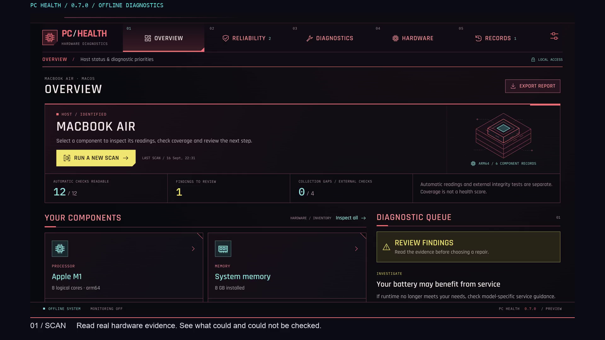

# PC Health

**Offline hardware diagnostics, guided troubleshooting, and local reliability monitoring.**

PC Health helps you investigate an unreliable computer before buying replacement parts. Read the evidence a device actually exposes, follow a symptom-specific test, and keep a record of what changed. Built for everyday computer owners and technicians, with a futuristic desktop interface.

**Version 0.8.0 · Development preview · macOS / Windows / Linux adapters**

[](docs/media/pc-health-demo.mp4)

**[Watch the 30-second demo](docs/media/pc-health-demo.mp4)** · [Install and share](SHARING.md) · [Telemetry coverage](TELEMETRY_COVERAGE.md)

The demo shows a real macOS scan and an explicitly labeled example repair case. It was recorded with a disposable profile, separate from personal scan history.

## New in 0.8: recovery verification

Capture fault evidence before a repair, record the approved action you performed, and verify the same sources over repeated checks. Missing telemetry, counter resets, stale samples and critical regressions cannot produce a stable result. The original evidence remains attached. See [the research, verification policy and next implementation stages](SELF_HEALING_RESEARCH.md).

The diagnostic watchdog also now waits for failed workers to exit, preventing orphaned collector processes. Automatic OS repair is not enabled. The video below the introduction shows the earlier 0.7 interface.

On macOS, `npm run install:local` builds and replaces one main app in `~/Applications/PC Health.app`, using temporary build staging rather than leaving another runnable copy in the project.

## What you can do

| Task                                           | How PC Health helps                                                                                                                                                         |
| ---------------------------------------------- | --------------------------------------------------------------------------------------------------------------------------------------------------------------------------- |
| Investigate a drive                            | Read supported SMART/NVMe health, endurance, spare capacity, errors, temperature and lifecycle counters. Inspect the source and check coverage.                             |
| Troubleshoot charging or short battery life    | Compare reported battery capacity and condition, then follow checks that separate charge settings, cables, adapters and the battery.                                        |
| Investigate heat, crashes or resource pressure | Review available thermal, memory, graphics, service, filesystem and network evidence with a recommended next step.                                                          |
| Find out when a computer slows down            | Record a normal workload, mark the slowdown, review measured signals, and compare a repeat after one change. Process-name collection is optional and off by default.        |
| Work through a repair                          | Use seven guided workflows for storage, charging, cooling, crashes, startup, display and input. Keep test results, diagnostic codes, actions and resolution notes together. |
| Check input and display hardware               | View physical key responses and static display patterns. Key checks do not retain typed text.                                                                               |
| Watch for changes                              | Opt in to local periodic reliability checks and, separately, desktop notifications. Review snapshots, trends and alerts.                                                    |
| Hand over useful evidence                      | Keep local scan history and export hardware, investigation or repair reports. Review notes and device labels before sharing.                                                |

The replacement guide includes an offline candidate catalog and compatibility questions. Exact compatibility is **not yet verified** against manufacturer service manuals or every device configuration.

## Evidence you can trust

Each check separates **what was collected** from **what can be concluded**. Missing permissions, an unsupported sensor, a failed collector and an external test that has not been run remain visible. A readable temperature without an appropriate threshold is unassessed; an empty event log is not a passing physical-memory test.

There is no universal wear percentage for a CPU, RAM module, GPU or power supply. Resource pressure and operating load can explain symptoms, but do not establish damaged hardware. PC Health does not predict a component's remaining lifespan, certify physical integrity or repair hardware automatically.

On the development Apple M1 machine, all **12 automatic scan checks** completed; **four external inspections** were listed separately. This is a result from one device, not a promise that every OEM exposes all readings.

## Platform coverage

| Area                            | macOS                                         | Windows                                                                 | Linux                                                                 |
| ------------------------------- | --------------------------------------------- | ----------------------------------------------------------------------- | --------------------------------------------------------------------- |
| Component inventory             | Native OS inventory                           | CIM / PowerShell inventory                                              | OS and sysfs inventory                                                |
| Drive health                    | Bundled universal smartctl                    | Bundled x64 smartctl; identity and permissions checked                  | Installed smartctl, when available                                    |
| Thermal / cooling               | Native system thermal state                   | Firmware thermal zones; optional existing LibreHardwareMonitor provider | Exposed hwmon sensors and alarms                                      |
| Memory resources                | Kernel pressure and swap                      | Available-memory and commit counters                                    | Memory and I/O pressure, OOM history                                  |
| Graphics                        | Metal availability and memory model           | Device status, driver recovery events; supported NVIDIA readings        | Supported NVIDIA readings and AMD RAS counters                        |
| Additional reliability evidence | Battery, services, capacity, network counters | Battery, services, capacity, network and retained hardware events       | Battery, systemd, capacity/inodes, network, EDAC, md and optional ZFS |

Readings depend on hardware, drivers, OS APIs and permissions. macOS thermal state is system pressure, not CPU temperature. PC Health installs no sensor kernel driver. Some Windows raw-drive reads require explicitly reopening the application as administrator.

**Qualification:** real scanning and packaged helper execution have been verified on the development Apple silicon Mac. Windows, Intel Mac and Linux real-device qualification remains pending. See [the detailed coverage matrix and primary sources](TELEMETRY_COVERAGE.md).

## Install a preview

Preview packaging produces:

- **macOS 13+:** universal DMG and ZIP for Apple silicon and Intel.
- **Windows x64:** per-user installer and ZIP.
- **Linux:** source development and an AppImage build target; no qualified Linux distribution is included in the current preview.

The macOS preview has an ad-hoc integrity signature, with no Developer ID signature or notarization. Windows packages have no Authenticode publisher signature. Downloaded previews can trigger operating-system trust warnings. Installation details and artifact names are in [SHARING.md](SHARING.md).

Generated installers belong in **GitHub Releases**, not in the source repository. Until a release is published, build the app locally or obtain a preview directly from the maintainer.

## Run from source

Use **Node.js 22.12+**; Node.js 24 is used in CI. Dependency installation and build-tool downloads need internet. Installed diagnostics run offline.

```sh
npm ci
npm run dev
```

The development command starts Electron and a local Vite server. React and CSS changes reload automatically; restart development after changing Electron code.

To run the production build locally:

```sh
npm run build
npm start
```

macOS native-helper builds require Apple's command-line developer tools. Optional platform sources such as Linux smartmontools and Windows LibreHardwareMonitor are described in [TELEMETRY_COVERAGE.md](TELEMETRY_COVERAGE.md).

## Build shareable packages

```sh
npm run dist:mac   # macOS host: universal DMG + ZIP
npm run dist:win   # Windows x64 installer + ZIP
```

Packages are written to `release/0.8.0/`. The macOS script stages signing outside cloud-managed Documents folders. The vendor directory includes the drive-reader binaries, corresponding source and license notices; keep them together when distributing the app.

After building both platforms locally, validate their contents and generate checksums:

```sh
node scripts/verify-packages.mjs
```

The manually triggered **Build shareable preview packages** GitHub Actions workflow builds macOS and Windows artifacts. It does not publish a release automatically.

## Privacy and control

- No account, cloud AI, telemetry-upload endpoint or internet connection is required for installed diagnostics.
- Scans, repair cases, investigations and monitoring evidence are stored locally. Reports can contain device labels and notes you entered.
- Monitoring and desktop notifications are separate opt-ins and stay off after launch. Monitoring stops when the application closes; no background daemon is installed.
- Collectors use bounded, read-only commands. No firmware update, restart, stress test, service repair or privilege elevation runs automatically.
- Guided external diagnostics can require a restart, separate software or networking. Their results are recorded as user reports, separately from collected evidence.

## Verification and architecture

The current suite contains **180 unit tests** covering parsing, missing and malformed readings, disk attribution, evidence interpretation, persistence and compatibility with older records. Desktop scripts exercise scans, repairs, workload recordings, reliability, accessibility and window layouts.

```sh
npm test
npm run typecheck
npm run build
npm run test:desktop
```

Additional workflows: `test:repairs`, `test:investigations`, `test:reliability`, `test:accessibility` and `test:layout`. Desktop tests use isolated profiles. A packaged-telemetry test is documented in [SHARING.md](SHARING.md).

| Location                | Purpose                                                            |
| ----------------------- | ------------------------------------------------------------------ |
| `src/`                  | React interface, local fonts, navigation and diagnostic tools      |
| `src/shared/`           | Typed evidence models, interpretation rules, workflows and reports |
| `electron/collectors/`  | Passive platform adapters and drive-reading helpers                |
| `electron/reliability/` | Isolated probes, snapshots, trends and local alerts                |
| `electron/observation/` | User-started workload sampling                                     |
| `native/`               | Read-only macOS Swift helper                                       |
| `tests/` and `scripts/` | Unit tests, desktop verification and packaging                     |
| `vendor/`               | Diagnostic executables, pinned corresponding source and notices    |

A headless reliability entry point is also available after building:

```sh
node dist-electron/health-cli.cjs --once
node dist-electron/health-cli.cjs --help
```

It emits local JSON, supports an explicitly started watch mode, and reports incomplete coverage through its exit status. It is an experimental per-host probe; fleet management and automatic remediation are future work.

## Project notes

- [Telemetry coverage and implementation sources](TELEMETRY_COVERAGE.md)
- [Reliability research and architecture](RELIABILITY_RESEARCH.md)
- [Requirements](REQUIREMENTS.md) and [extended roadmap](REQUIREMENTS_EXTENSION.md)
- [Design system](DESIGN_SYSTEM.md)
- [Sharing preview builds](SHARING.md)
- [Publishing with your own Git identity](docs/PUBLISHING.md)
- [Reproducing the demo](docs/DEMO.md)

## License and credits

PC Health currently declares `UNLICENSED`; no open-source license has been granted for the application source. Third-party components retain their own licenses. smartctl 7.5 is distributed as a separate executable with its GPL-2 license and corresponding source; see [vendor notices](vendor/NOTICE.md). Rajdhani and IBM Plex Mono font licenses are included in [public/licenses](public/licenses/).

The interface uses original application layouts inspired by futuristic game interfaces. No Cyberpunk 2077 artwork or proprietary game assets are bundled.
